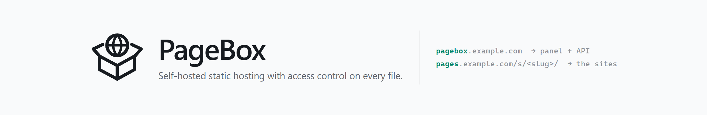
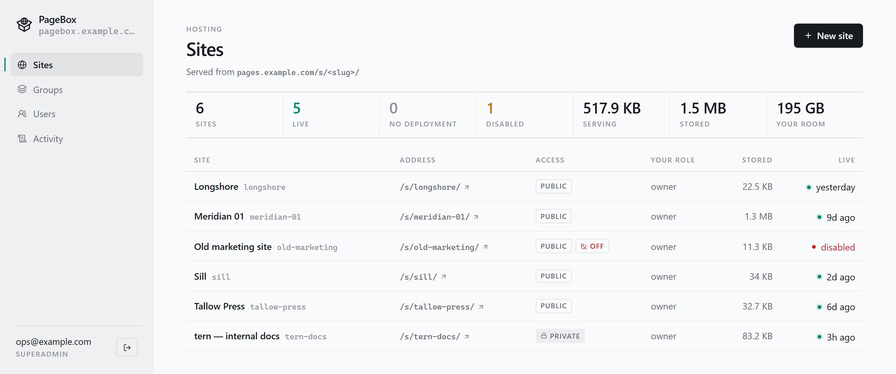
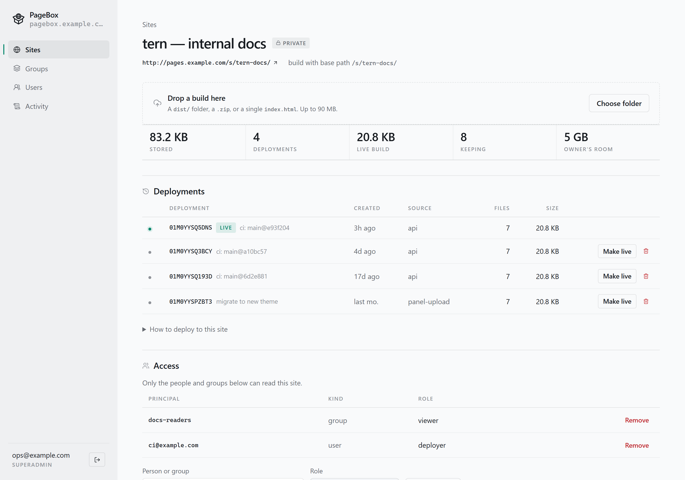
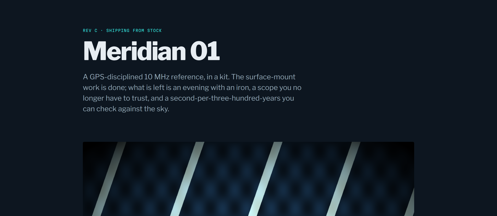
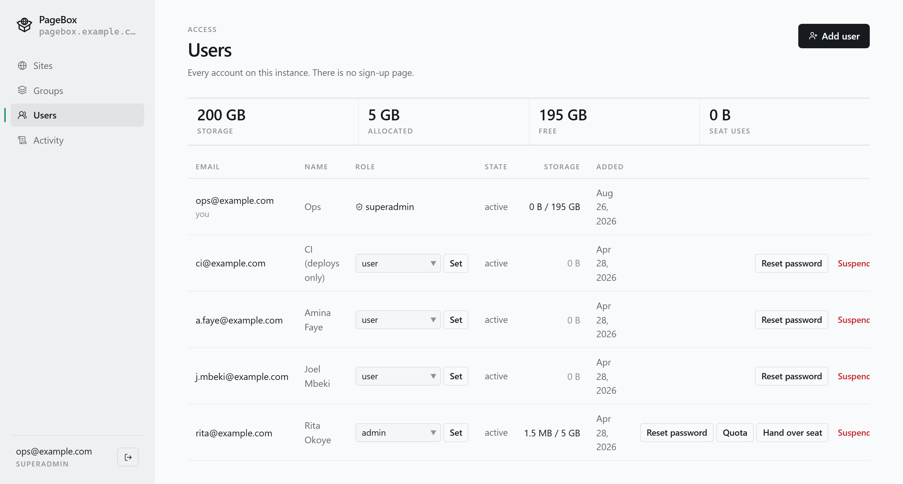
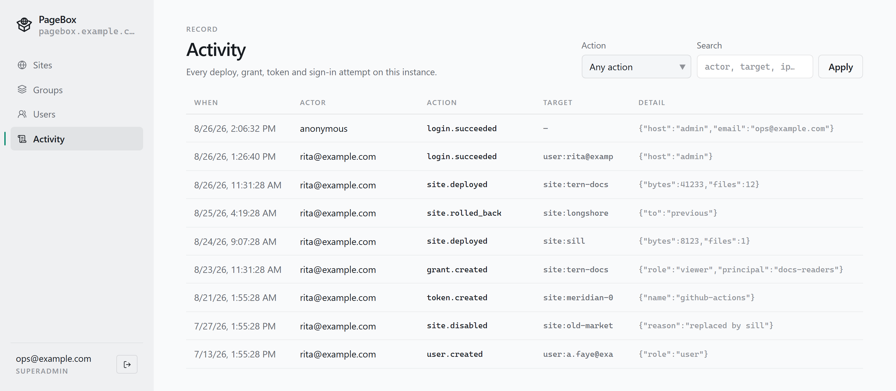
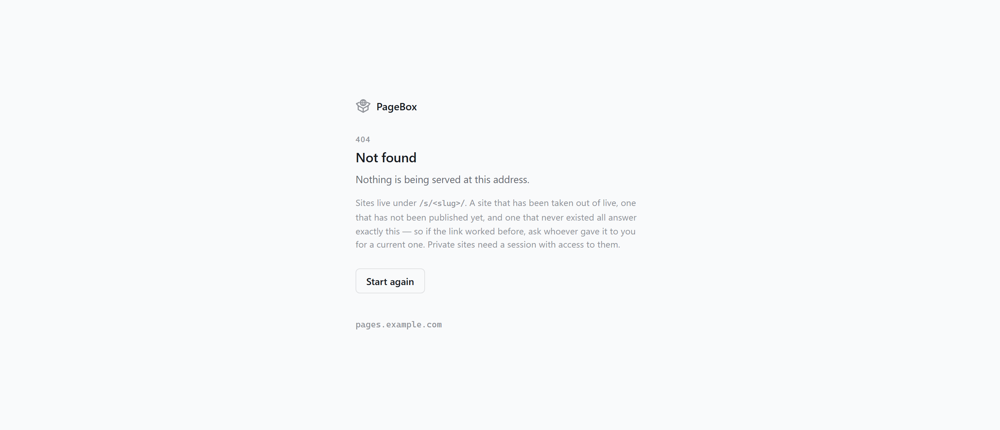
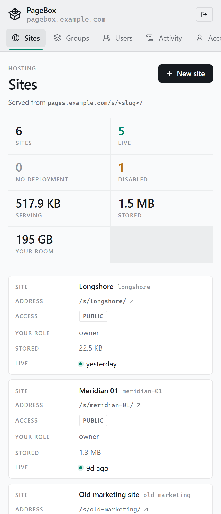

<p align="center">
  <picture>
    <source media="(prefers-color-scheme: dark)" srcset="docs/media/banner-dark.png" />
    
  </picture>
</p>

<p align="center">
  <a href="https://github.com/AlexAdiaconitei/PageBox/releases/latest"></a>
  <a href="https://github.com/AlexAdiaconitei/PageBox/pkgs/container/pagebox"></a>
  <a href="https://github.com/AlexAdiaconitei/PageBox/actions/workflows/ci.yml"></a>
  <a href="https://alexadiaconitei.github.io/PageBox/"></a>
</p>

**PageBox is static hosting you run yourself, with access control that reaches every file.**
One superadmin runs the instance and seats admins; each admin runs their own sites,
accounts and groups. A site is `public` or `private`, and on a private one **every asset** —
the `.js`, the `.css`, the `.png` — goes through the authorisation check, not just the HTML.

It never builds anything. It receives an artifact that is already built — a `dist/`, a zip,
a lone `index.html` — over an API token or by drag & drop, stores it immutably in S3, and
serves it. Every deployment is kept whole, so **rollback is moving a pointer**.

<p align="center">
  <picture>
    <source media="(prefers-color-scheme: dark)" srcset="docs/media/sites-dark.png" />
    
  </picture>
</p>

---

## Two hostnames, always

```
https://pagebox.example.com/          → admin panel + API
https://pages.example.com/s/<slug>/   → the deployed sites
```

They must be different hostnames. If `PAGEBOX_ADMIN_HOST == PAGEBOX_SITES_HOST` the process
exits at startup: sharing an origin would let any hosted page call the admin API with the
admin cookie attached. The panel's origin is also the one that never hosts somebody else's
JavaScript — that separation is the first security property of the whole design, so it is
enforced rather than recommended.

## Deploy

Drop a folder on the site page, or push a zip from CI with a deploy token. Both land in the
same place and produce the same immutable deployment.

```bash
curl -sfS -X POST https://pagebox.example.com/api/v1/sites/docs/deployments \
  -H "Authorization: Bearer $PAGEBOX_TOKEN" \
  -H "Content-Type: application/zip" \
  --data-binary @dist.zip
```

<p align="center">
  <picture>
    <source media="(prefers-color-scheme: dark)" srcset="docs/media/site-detail-dark.png" />
    
  </picture>
</p>

Every build a site has ever had stays listed with its size, file count, source and the
commit note it was pushed with. **Make live** switches the pointer; nothing is rebuilt and
nothing is re-uploaded. Deployment ids are ULIDs, so the history sorts itself.

The drop area runs a **preflight** before anything is uploaded: it reads the HTML, finds the
absolute URLs that would break under `/s/<slug>/`, and names the exact option to change for
the generator that produced them — `basePath` for Next, `base` for Astro and Vite, `baseUrl`
for Docusaurus, `kit.paths.base` for SvelteKit, and so on. Getting that wrong is the single most
common way a site that works locally 404s once it is deployed, and it is cheaper to catch it
in the browser than after the upload.

Deploy tokens are `pbx_` keys, stored hashed, scoped to one site, optionally expiring. A
token pointed at a site it was not issued for gets a 404 — the same answer as a slug that
does not exist. Full API in [`docs/deploy-api.md`](docs/deploy-api.md).

## Serve

Resolution follows what real generators emit, in this order:

| Request | Answered with |
| ------- | ------------- |
| `/s/docs/` | `index.html` |
| `/s/docs/about` | `about.html`, then `about/index.html` |
| `/s/docs/guide/` | `guide/index.html` |
| anything unmatched, SPA on | `index.html`, status **200** |
| anything unmatched, SPA off | the site's own `404.html`, status **404** |

Content-hashed assets are served `immutable` for a year and everything else revalidates, so
a deploy is visible immediately and a chunk is never fetched twice. Precompressed `.br` and
`.gz` siblings are used when the client accepts them, byte ranges and `If-None-Match` work,
and dotfiles, `__pb/*` and path traversal are refused whatever the deployment contains.

<p align="center">
  
</p>

## Private sites

A private site authorises **every file**. Checking only the HTML leaves the content readable
to anyone who learns an asset URL, which is not privacy — it is obscurity with extra steps.

| Caller | Answer |
| ------ | ------ |
| granted, directly or through a group | the file |
| signed in, no grant | **404** — the same answer as a site that does not exist |
| anonymous, navigating | **302** to the sign-in page |
| anonymous, sub-resource | **401**, no `Location` |

The last two differ on purpose: a 302 answering a `<script src>` arrives as HTML where code
was expected, so a session expiring mid-visit would break the page in silence instead of
prompting a sign-in. Every private response — 404s and redirects included — carries
`private, no-store` plus the CDN-specific headers, because one private asset cached at an
edge is readable without a session.

Grants go to a person or to a group, in three roles: `viewer` reads, `deployer` also
uploads, `owner` also administers the site.

<p align="center">
  
</p>

Accounts are issued, never self-registered. An admin sees only the accounts it created —
the boundary is the query, not a filter on the page — and the superadmin seat is a single
seat, enforced by a partial unique index and handed over rather than granted again. The
whole model is in [`docs/access.md`](docs/access.md).

## Everything is on the record

<p align="center">
  
</p>

Every deploy, rollback, grant, token and sign-in attempt — successful or not — lands in the
audit log with its actor, target, IP and detail. It is filterable by action and searchable
by actor, target or address.

## Even the 404s are yours

Nothing here falls back to the browser's own error page. Whatever answers — the host
dispatch, the site server, the panel — renders the same self-contained document, in your
reader's theme, with no stylesheet, script or image to fetch.

<p align="center">
  <picture>
    <source media="(prefers-color-scheme: dark)" srcset="docs/media/not-found-dark.png" />
    
  </picture>
</p>

One 404 covers every reason a site can be missing — unknown slug, taken out of live, no
deployment yet, private with no grant — byte for byte identical, so the sites host never
becomes an oracle for which private sites exist. The page says so plainly rather than
leaving a visitor to guess. A deployment that ships its own `404.html` still wins inside its
own site.

## It fits on a phone

<p align="center">
  
</p>

The rail becomes a row of tabs, the dense tables become cards, and controls grow to real
touch targets on coarse pointers only — a mouse keeps the tighter console.

## Run it

The image is published, so nothing here builds anything:

```
ghcr.io/alexadiaconitei/pagebox:0.1.0
```

### Standalone (Postgres + MinIO included)

Two files in an empty directory — no clone needed, though cloning also gets you the example
builds in [`examples/`](examples/README.md):

```bash
curl -O  https://raw.githubusercontent.com/AlexAdiaconitei/PageBox/main/docker-compose.yml
curl -o .env https://raw.githubusercontent.com/AlexAdiaconitei/PageBox/main/.env.example
# set AUTH_SECRET, the bootstrap admin credentials, and PAGEBOX_TAG=0.1.0 to pin the image
docker compose up -d          # app + postgres + minio
docker compose --profile cache up -d   # + valkey (needed for >1 replica)
docker compose --profile proxy up -d   # + traefik routing both hostnames on :80
```

Without the proxy profile the app is on `http://localhost:3000` and you address the hosts
with a header:

```bash
curl -H "Host: pagebox.localhost" http://127.0.0.1:3000/healthz
curl -H "Host: pages.localhost"   http://127.0.0.1:3000/
```

With the proxy profile, `*.localhost` resolves to 127.0.0.1 on most systems, so
`http://pagebox.localhost/` works directly.

First sign-in: the panel is at `PAGEBOX_ADMIN_HOST`, with the credentials from
`BOOTSTRAP_ADMIN_EMAIL` / `BOOTSTRAP_ADMIN_PASSWORD`. That password is a handover
credential, not a password: nothing else in the panel opens until it has been replaced.

### Dokploy

One application, provider **Docker**, image `ghcr.io/alexadiaconitei/pagebox:0.1.0`, then
**Add Domain twice on that same application** — both at container port 3000, one for the
panel and one for the sites. Not two apps, not two ports, not two paths: PageBox listens on
one port and splits by `Host`, and hostnames are the only split browsers enforce for
cookies. Environment variables next, then health check path `/healthz`.

Full walkthrough, including why the port and path variants do not work:
[`docs/dokploy.md`](docs/dokploy.md) · [documentation site](https://alexadiaconitei.github.io/PageBox/docs/install/dokploy).

### Development

```bash
pnpm install
cp .env.example .env
cp .env.local.example .env.local      # host-side overrides for the compose services
docker compose up -d postgres minio   # dependencies only
pnpm dev
```

Then open **http://pagebox.localhost:5173** for the panel and
**http://pages.localhost:5173** for the sites. Plain `localhost` answers 404 on purpose:
PageBox routes by hostname, and a request that is neither host is not its business.

`.env` holds container hostnames, which only resolve inside the compose network;
`.env.local` points the same variables at the published ports and is loaded after it. Both
are read by the `dev` and `db:*` scripts through Node's `--env-file-if-exists` — Vite does
not put `.env` into `process.env`, so without this the app starts and then refuses to serve.

`pnpm check` type-checks, `pnpm test` runs the unit tests, `pnpm db:generate` writes a new
migration after a schema change.

### Something to deploy

[`examples/`](examples/README.md) holds five deployments, each a different shape: one
self-contained file; hashed and unhashed assets side by side; images, a PDF and a zip;
nested directories with a real `404.html`; and a client-routed app for the SPA fallback.
Drop one on a site and every serving rule above has something to chew on.

### The integration suite

`pnpm test` runs the unit tests offline. The integration suite needs a running stack and
skips itself without one:

```bash
node scripts/seed-demo.mjs     # seeds /s/demo/, a private twin, and an account for the suite
PAGEBOX_E2E_BASE=http://127.0.0.1:3000 \
PAGEBOX_E2E_EMAIL=e2e-admin@example.com PAGEBOX_E2E_PASSWORD=e2e-admin-password \
pnpm test
```

The suite issues its own deploy token through the panel, the same way a person would.
`scripts/seed-demo.mjs --dir path/to/dist` publishes a real build instead of the generated
one, and `scripts/verify-real-build.mjs` takes a token directly.

## Startup behaviour

The container does everything it needs on boot, because neither Dokploy nor
`docker compose` has a release phase:

1. applies pending migrations, under a Postgres advisory lock;
2. creates the S3 bucket if it is missing (MinIO and Garage alike);
3. creates the first superadmin when the instance has no users, flagged
   `must_change_password`.

Any failure exits the process rather than serving half-configured traffic. Both the
migration and bucket steps can be turned off (`PAGEBOX_MIGRATE_ON_START`,
`PAGEBOX_ENSURE_BUCKET_ON_START`).

## Taking a site down, and keeping its history bounded

A site with a deployment serves it — until somebody says otherwise. **Disable serving** on
the site page takes it off the air without deleting anything: every request answers 404, for
everyone, and the deployments, grants and tokens stay where they are. Enabling it serves the
same build again.

**Delete site** is the other end of that: it removes the site with every deployment, object,
grant and deploy token it has, and releases the slug. It is superadmin-only and asks for the
slug to be typed back, because nothing undoes it. Reach for disable first.

Every deployment is a *full* copy of the build, which is what makes rollback a pointer move
and what makes a site deployed on each push grow without bound. A site can carry a
**retention limit** — set when it is created or later in its settings — and each upload then
deletes the deployments that fall past it. Two things it never does: prune the live
deployment, and prune before the new build is stored. It is not silent either: the panel
names what the next deploy will delete before you press it, and the API answers with
`pruned` and `prunedBytes`.

## Storage quotas

Each admin may hold so many bytes across every deployment their sites keep. Set
`PAGEBOX_STORAGE_BYTES` to declare what the instance has to give away and the pool becomes
real — allocated, free, and a superadmin whose own room is whatever the admins leave over;
leave it unset and the per-admin limits still hold on their own. Quotas cannot sum past the
total, an over-quota admin keeps serving but cannot deploy, and a site can be handed to
another admin along with its storage.

## Upload cap

`MAX_UPLOAD_BYTES` defaults to **100 MB** and is configurable. The default exists because
Cloudflare's proxy rejects larger request bodies on non-Enterprise plans, which is the first
deployment target — a deployment that is not behind Cloudflare (plain Traefik, LAN,
Tailscale, a direct port) can raise it freely. The value also becomes adapter-node's
`BODY_SIZE_LIMIT`, so the app-level cap and the HTTP-level cap can never drift apart.

## Configuration

Every variable is documented in [`.env.example`](.env.example). The ones without a default
are required and validated at startup: an invalid configuration stops the process with a
list of what is wrong, rather than serving traffic with a missing secret.

## Built on

SvelteKit 2 with Svelte 5 on `adapter-node`, Postgres through Drizzle, S3 through the AWS
SDK (MinIO, Garage, or anything else that speaks S3), better-auth for sessions and deploy
tokens, Tailwind 4, and optionally Valkey once there is more than one replica. Node 22+.

## Status

**0.1.0, published.** Two-host dispatch, schema and migrations, health check, the image on
GHCR, compose stack and Dokploy guide; serving from S3 with the full resolution, caching and
range semantics; the deploy API with rollback and an audit trail; the admin panel with
users, groups, grants, deploy tokens, quotas, retention and deployment history; private
sites enforced on every file; drag & drop uploads with the preflight; the security checklist
running as an integration suite in CI against a real Postgres and a real S3.

Every milestone through M7 is done and the four decisions that were left open are closed —
see [`docs/IMPLEMENTATION-PLAN.md`](docs/IMPLEMENTATION-PLAN.md). What is left is not code:
one hostname per site, and whatever the first instances ask for.

## Documentation

**[The documentation site](https://alexadiaconitei.github.io/PageBox/)** is the readable
version of everything below — a step-by-step path from `docker compose up` to a site
deployed from CI, with the base-path recipe for each generator filled in with your own
slug. It is built from [`gh-pages/`](gh-pages/README.md) with Fumadocs, exported to static
files, and deployed to GitHub Pages on every push — and to PageBox itself on every release,
which is the shortest honest test of whether this thing hosts a real site.

The Markdown below is the source those pages were written from, and stays as the reference
kept beside the code:

- [Deploy API and CI setup](docs/deploy-api.md)
- [Accounts, roles and grants](docs/access.md)
- [Base paths: what each generator does not prefix](docs/base-paths.md)
- [Deploying on Dokploy](docs/dokploy.md)
- [Example sites](examples/README.md)
- [Design brief](docs/PLAN-static-hosting.md) · [Implementation plan](docs/IMPLEMENTATION-PLAN.md)
- [Changelog](CHANGELOG.md)

## Licence

[Business Source License 1.1](LICENSE), with **Apache 2.0** as the Change License on
**2030-08-29** — on that date this version becomes open source outright, and every later
version four years after its own release.

Until then:

| You are | Running it costs |
| ------- | ---------------- |
| an individual, personally — a home instance, a hobby project, study, research | nothing |
| an organisation — company, government body, public institution, school, non-profit | a commercial licence, **including private internal deployment** |

Anyone may read, modify, fork and redistribute the source, and anyone may run it
non-production to evaluate it. What needs a licence is production use by an organisation,
whether or not the sites it hosts are public and whether or not anyone is charged for them.

Want one? [Open an issue](https://github.com/AlexAdiaconitei/PageBox/issues) — a commercial
licence is a conversation, not a refusal.

The sites *you* deploy on PageBox are yours. This licence covers PageBox itself, not the
content it serves.
